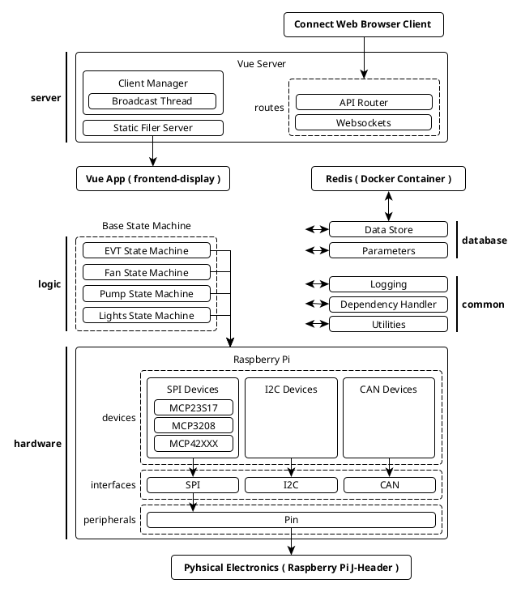

# Raspberry Pi Controller (UMATT)

| [__version: 24.0.1__](https://github.com/umatt-ece/rpi-controller/blob/main/CHANGELOG.md) | [GitHub](https://github.com/umatt-ece/rpi-controller) |

> This repository contains backend code for operating the tractor, designed to run on a Raspberry Pi microcontroller (or some equivalent Linux-based microcontroller). It features a web-based, Vue app interface (see the [display-frontend](https://github.com/umatt-ece/display-frontend) repository for more info).

### Table of Contents
[Structure]()  
[Development]()  


## Structure



## Development

### Dependencies

- [Python]()
- [Docker]()

### Setup

Clone repository from git
```shell
git clone git@github.com:umatt-ece/rpi-controller.git
git checkout development
git submodule init
git submodule update
```

Generate the _docker-compose_ files
```shell
python3 scripts/generate_docker_compose_files.py
```

Start Project
```shell
docker-compose -f docker-compose-rpi.yml up --build -d      # Raspberry Pi
docker-compose -f docker-compose-linux.yml up --build -d    # Linux
docker-compose -f docker-compose-windows.yml up --build -d  # Windows
```


## Contributors

> __Svan B.__  
> _Team Lead 2023_
> 

> __Kameron R.__  
> _Software Lead 2023_  
> ronaldk1@myumanitoba.ca
