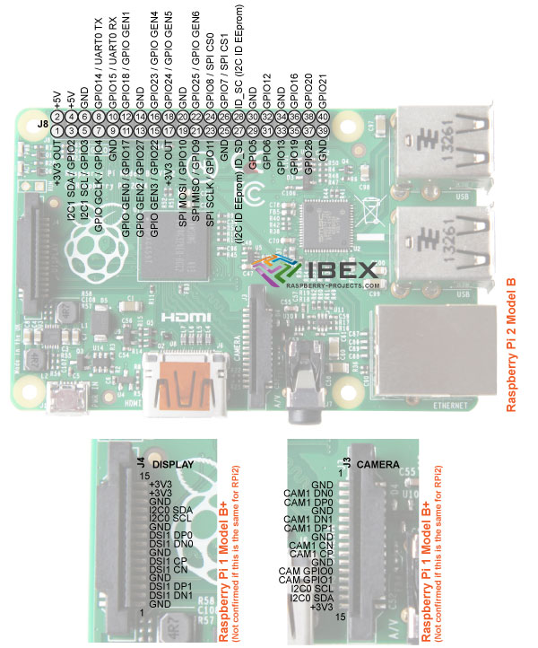
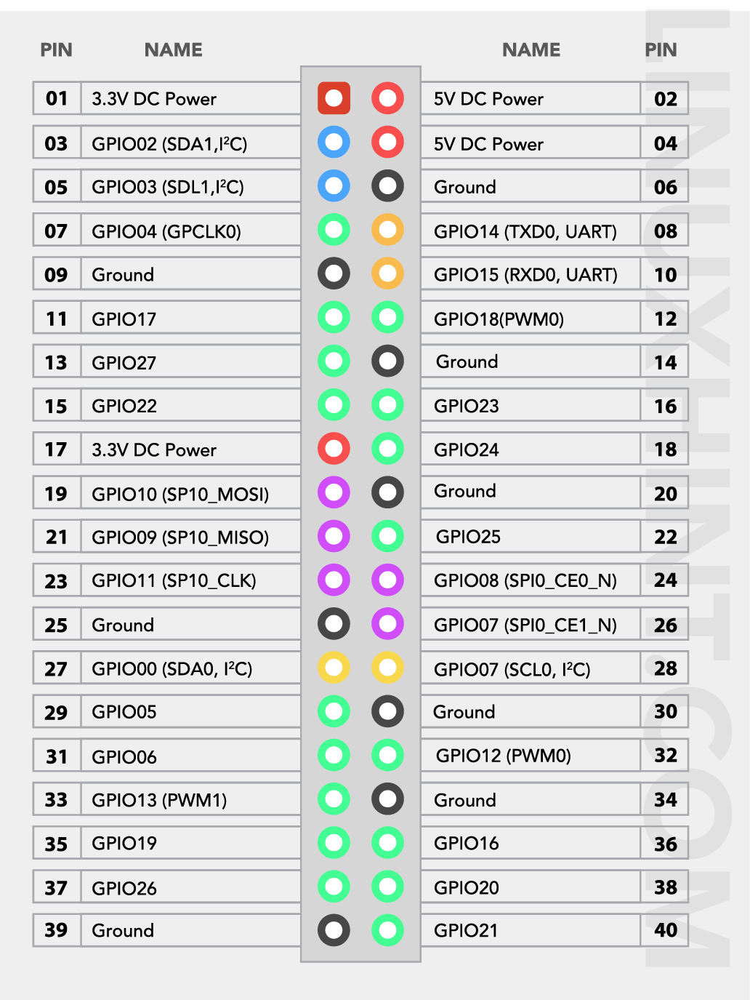

# Pin Layout

## Hardware Pin Mapping

| Pin Description | RPi 2B | RPi 4B |
|:----------------|:------:|:------:|
| CLK (SPI)       |   23   |   23   |
| MOSI (SPI)      |   10   |   19   |
| MISO (SPI)      |   25   |   21   |
| POT Select      |   8    |   24   |
| ADC Select      |   5    |   29   |
| GPIO1 Select    |   24   |   18   |
| GPIO2 Select    |   9    |   13   |
| GPIO3 Select    |   11   |   11   |
| GPIO4 Select    |   6    |   31   |
| Accessory Power |   16   |   17   |
| Power Down      |   12   |   32   |

## Raspberry Pi 2B

## Raspberry Pi 4B

