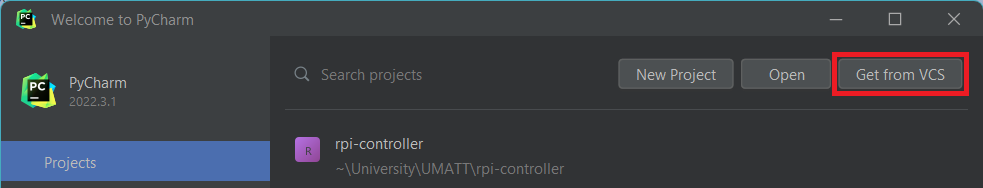
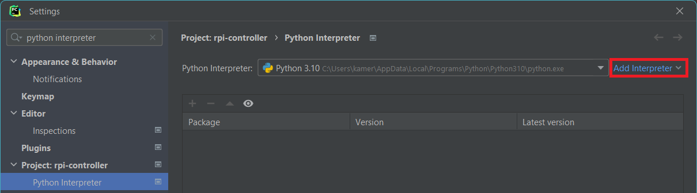
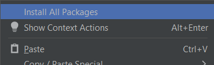

# Setup

## Code Editors

There are lots of good code editors out there. Pycharm, Visual Studio Code, and Sublime Text are just some of
the many great tools out there that can be used completely free. However, for the purposes of these tutorials, I will
be demonstrating everything using Pycharm. I highly recommend PyCharm, as well as all the other JetBrain products for
a few key reasons:

1. Professional versions of all their products (PyCharm, WebStorm, DataGrip, and CLion just to name a couple) can be
downloaded completely free as a student. Seeing as this is a University Design Team, that means every member will have
access to these products completely free.
2. It is cross-platform (Windows, MacOS, Linux) and their products provide tailor-made support for a wide range of
programming languages.
3. It has a wide variety of built-in tools, so you rarely have to go looking for extra plug-ins (and if it doesn't have
the tool installed it's often smart enough to recommend one to you).
4. Excellent git management, virtual environment control, and very smart refactoring tools
5. Like most other code editors, most everything is customizable and a wide array of shortcuts exist to help improve
your workflow.

If you plan to go the route of JetBrain products (ie. PyCharm) I recommend first downloading their software management
tool, _JetBrains Toolbox_, from [here](https://www.jetbrains.com/lp/toolbox/).

## Git

We use git and GitHub to manage code our code base, track tickets, and provide a centralized location for all our
software resources. If you are not familiar with git, or feeling a little rusty, check out these
[resources](https://github.com/umatt-software/new-member-resources. (pending...)

You can clone this repository to your local machine by running the following on the command line. Make sure you have a
valid ssh key for your machine and have it added to your GitHub account.

```shell
git clone git@github.com:umatt-software/rpi-controller.git
```

Alternatively, if you are using PyCharm, close any already open projects and select "Get from VCS"



Then select _git_ as your version control, and enter the following URL.
```
https://github.com/umatt-software/rpi-controller.git
```

## Docker

While Docker can be installed as a stand-alone piece of software, the Docker Desktop client provides a simple and
convenient interface for managing Docker images, containers, and volumes. Follow the link to download
[Docker Desktop](https://www.docker.com/products/docker-desktop/) for your operating system of choice.

...

## Python

Python is an interpreted coding language which we have chosen for its powerful features yet intuitive learning curve.
All three components of the controller backend (server, database, logic & I/O) have been implemented primarily using
Python. Hopefully by this point in your studies you have a good grasp of Python and how to at least write simple
programs with it. However, if not or you're just feeling like you need a little refresher, check out these
[resources](https://github.com/umatt-software/new-member-resources). (pending...)

Currently, as of version _0.0.1_ we are using Python version 3.10, which can be downloaded from
[here](https://www.python.org/downloads/). If you already have a more current version of Python installed, that is
completely fine, it just means not everything has been tested with the latest version, and therefore we cannot
guarantee everything will work flawlessly in that version. It should... but you never know lol.

### Python Virtual Environment

Once you have Python installed, we need to set you up a python virtual environment (or venv for short). The reason we
want to do this is that we will be downloading a number of python libraries. Rather than clutter or potentially damage
our base installation of Python, we want to create a 'virtual' copy of python. If you're curious, you can find more
information [here](https://docs.python.org/3.10/library/venv.html).

If you're using PyCharm, navigate to your _interpreter settings_ which can be found at:
```
File | Settings | Project: rpi-controller | Python Interpreter
```
Or use `Ctrl + Alt + S` to bring up the settings and search "Python Interpreter". Once you've found this page select
the option _Add Local Interpreter_ from the _add interpreter_ drop-down.



PyCharm should be clever enough to fill in all the information in this dialog, but check everything is all good and
select _OK_.

### Install Requirements

We now need to install all the python packages (also called libraries) required to run the project. If you aren't
familiar with _pip_, it is the default package installer for Python and allows us to easily install and manage
packages in the [Python Package Index](https://pypi.org/). In this project, we use _requirement.txt_ files to keep
track of required packages and their versions. Each directory that contains Python code has one of these files.

Each _requirements.txt_ file is just a list of packages and an optional version number. For example:

```requirements.txt
redis
uvicorn
fastapi
```

To install all _requirements.txt_ file, you need to run the following commands in the command line from the root
directory of the project (ie. `./rpi-controller`). Make sure you run them in your virtual environment.

```shell
pip install -r ./server/requirements.txt
pip install -r ./database/requirements.txt
pip install -r ./controller/requirements.txt
```

If you're using PyCharm, there is a very easy way to do this, just open up a _requirements.txt_ and right-click. Then
select _install all packages_.



Alternatively, if you are on Windows, there is a batch file,
[install-pip-requirements.bat](../scripts/install-pip-requirements.bat), to do this automatically for you.

## Node.js and NPM

The frontend web application is written in JavaScript, Node.js is a JavaScript runtime environment we use to run it.
You can download and install Node.js [here](https://nodejs.org/en/download/). As of version 0.0.1 we are using Node
version 16.18.0. Again, don't worry if you download a newer version, it just means that version hasn't been fully
tested with our project.

In order to manage packages, Node,js comes with a default Node Package Manager (NPM). NPM installs packages based on
the [package.json](../display/package.json) file. To actually install the required packages run the following command
from inside the `./display` directory.

```shell
npm i
```

NPM will create a `./node_modules` directory that contains all the code for the installed node packages.

[package.json](./package.json) also defines a number of commands that can be run by NPM, these include:

```shell
npm run serve  # compiles a hot-reloaded server for local development
npm run build  # compiles and minifies the project for production
```
